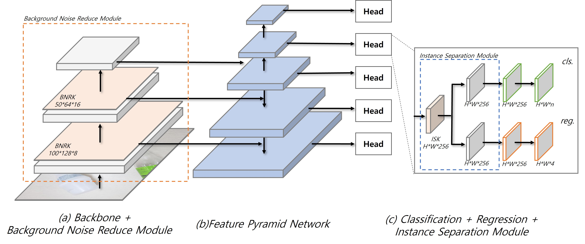

# EdgeLess Layer for Recyclable Trash Detection




## Introduction

We propose a novel anchor-free model with an edgeless kernel for recognizing and classifying complex unstructured recyclables, and a recyclables dataset required for model training. 

First, we create a recyclable dataset according to the resource separation and emission standards set by the Korean Ministry of Environment. Also, We define a class for waste that the general public should recycle and strengthen the annotation. 

Second, the proposed edgeless module consists of two types: Background Noise Reduce Module for correcting the feature map of the backbone and an Instance separation module for correcting the feature map of the head. Background Noise Reduce Module for the feature map of the backbone corrects the edges of the entire feature map of the input image. 

The Instance separation module for the feature map of head corrects the edges of each instance contained in the image. The result is improved detection accuracy for overlapping or small wastes. Our model with an Edgeless module shows optimal performance in recyclable recognizing. 

And we shall show that the AP score is improved by 3.9\% and the F1 score by more than 2\% compared to the latest models of the one-stage detector and compare the performance with other latest models.


The repo is based on **[mmdetection](https://github.com/open-mmlab/mmdetection)**.


## Installation

Please refer to [install.md](install.md) for installation and dataset preparation.


## Getting Started

### Train

#### Build Recyclables dataset (recycable dataset{})

* Download train2017, val2017 and annotations
* Prepare dataset

```text
mmdetection
├── mmdet
├── tools
├── configs
├── data
│   ├── coco
│   │   ├── annotations
│   │   ├── train2017
│   │   ├── val2017
```

* Check the model config


#### Train

* To train ELTD (ResNet-50, anchor-free)

```
python tools/train.py --config configs/eltd/eltd_r50_fpn_1x_coco.py
```


### Test


```
python demo/masati_inference.py --config ${CONFIG_FILE} --imgpath ${INPUT_IAMGE_FILE} --checkpoint ${CHECKPOINT_FILE}
```
Optional arguments:
- `--config ${CONFIG_FILE}`: Model config file
- `--imgpath ${INPUT_IAMGE_FILE}` : Path to folder with images to test
- `--checkpoint ${CHECKPOINT_FILE}` : Model checkpoint file

If you want to specify the result save directory in the command, you can edit an argument `--savepath ${YOUR_WORK_DIR}`.

#### F1 Score

* Confirm the `demo/f1score/sample_GT.csv` file. (If you test with your image, you have to write the csv file.)

```
python demo/f1score/f1_score.py --gt_file ${ANSWER_FILE} --pred_file ${YOUR_ANSWER_FILE}
``` 

#### Benchmark

* Small Size Backbone

|Model          |    Backbone     |    F1 Score  |  mAP  | Pretrained models |
|:-------------:| :-------------: | :-----------:| :---: | :-------:|
|YOLOv3    |  Darknet-53  |  71.379 |0.239 |[Download](https://drive.google.com/file/d/1j5gocy38kWh0FnS9yEnTD-R-hcNJi--c/view?usp=sharing)|
|SSD       |  VGG16       |  75.573 |0.307 |[Download](https://drive.google.com/file/d/1j0nEuIso0H56_i9ERkZbdK1Ow11MbxOd/view?usp=sharing)|
|RetinaNet |  R-50-FPN    |  77.161 |0.353 |[Download](https://drive.google.com/file/d/1L5nEZX5j11dvs4qkBCPCIeAQ70JvWfH3/view?usp=sharing)|
|YOLOF     |  R-50-FPN    |  82.404 |0.458 |[Download](https://drive.google.com/file/d/1j3PLLx0ZbN_X9msmFtfLVrqSKICkGPYr/view?usp=sharing)|
|SABL      |  R-50-FPN    |  79.805 |0.475 |[Download](https://drive.google.com/file/d/1e4nMsWcJz5tFpGAYF9BoF3ZkV9Ungi77/view?usp=sharing)|
|FSAF      |   R-50-FPN   |  80.212 |0.479 |[Download](https://drive.google.com/file/d/1KE512iI6W0rYqYoZ_jAdAkIkV5w0ECO0/view?usp=sharing)|
|**ELTD**  |   **R-50-FPN**   |  **82.849**  |**0.518** |[model](https://drive.google.com/file/d/15tNF1qiDDHKERrxVUeE017GjWW2deqKQ/view?usp=sharing)|

* Large Size Backbone

|Model          |    Backbone     |    F1 Score  |  mAP  | Pretrained models |
|:-------------:| :-------------: | :-----------:| :---: | :-------:|
|CornerNet      |  Hourglass104  |  84.724 | 0.575 |[Download](https://drive.google.com/file/d/1957d5S29wC77OQPQt92L52Vmtjzbryy3/view?usp=sharing)|
|CentripetalNet |  Hourglass104  |  79.326 | 0.586 |[Download](https://drive.google.com/file/d/175NUMA2CFsJ4DntoVdlUKVxqAjEdwaRq/view?usp=sharing)|
|**ELTD**       |   R-101-FPN    |  84.899 | 0.545 |[Download](https://drive.google.com/file/d/1WsQkUNNm2W3y6dfp7vzfUsfahgKFBLVn/view?usp=sharing)|
|**ELTD**       |  **X-101-64x4d-FPN**   |  **85.594** |**0.596** |[model](https://drive.google.com/file/d/15m57mcpxHermPc_betT8_LOVMbwFKUtR/view?usp=sharing)|


## Citation

```
@article{kang2021,  
  author={BoSeon Kang, ChangSeong Jeong},  
  journal={},   
  title={Edgeless Layer for Recyclable Trash Detection},   
  year={2021}, 
  pages={},  
  doi={}}
```
